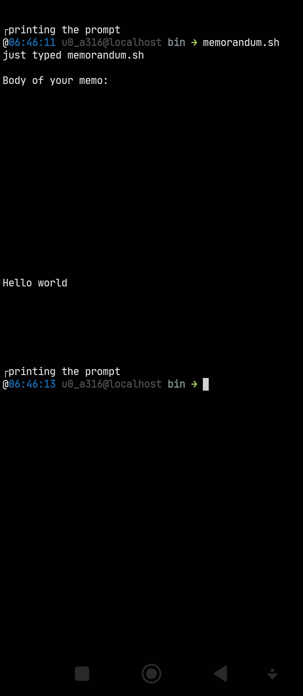

# memorandum


View random Samsung memo's on your all files

note: Please put your memo files in /sdcard/Download

## Usage

```bash
memorandum.sh
```

## Install

```bash
git clone https://github.com/luisadha/memorandum.git; cd memorandum && bash install.sh
```

## Extentions
- .memo
- .zip
- .txt
